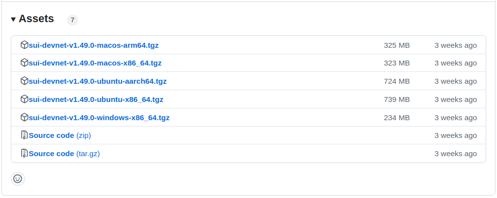
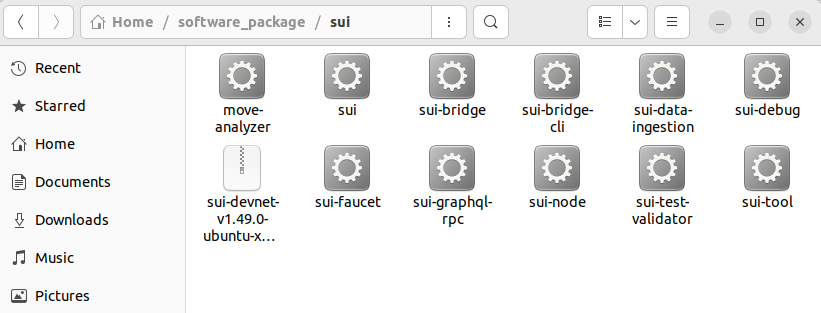
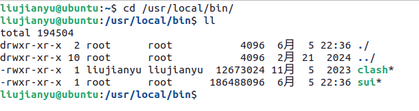
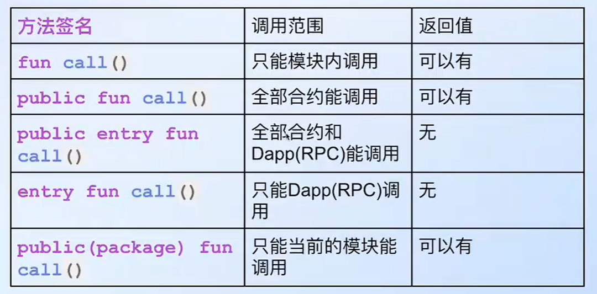

## 项目环境搭建
### SUI 安装
文档连接：https://docs.sui.io/guides/developer/getting-started/sui-install

01. Homebrew 安装，比较简单(但是容易出现bug，不推荐)，具体操作如下：
```
/bin/bash -c "$(curl -fsSL https://raw.githubusercontent.com/Homebrew/install/HEAD/install.sh)"     // 安装 Homebrew

=> Next steps:                                                                                      // 根据提示，将brew命令添加到 PATH。（下面命令分三次输入）
- Run these commands in your terminal to add Homebrew to your PATH:
    echo >> /home/liujianyu/.bashrc
    echo 'eval "$(/home/linuxbrew/.linuxbrew/bin/brew shellenv)"' >> /home/liujianyu/.bashrc
    eval "$(/home/linuxbrew/.linuxbrew/bin/brew shellenv)"


brew install sui                                                                                    // 安装 SUI
brew uninstall sui                                                                                  // 卸载 SUI

which sui                                                                                           // 查找 SUI 的安装目录，结果为：/home/linuxbrew/.linuxbrew/bin/sui

/bin/bash -c "$(curl -fsSL https://raw.githubusercontent.com/Homebrew/install/HEAD/uninstall.sh)"   // uninstall homebrew

```

02. GitHub上直接安装二进制源码
Url: https://github.com/MystenLabs/sui/releases.  选择对应的ubuntu版本即可.


```
tar -xzvf sui-devnet-v1.49.0-ubuntu-x86_64.tgz          // 解压压缩包
sudo cp sui /usr/local/bin/                             // 安装到 /usr/local/bin（需管理员权限）

sui --version                                           // sui 1.49.0-c596d498441c
```





### 插件安装
在 vscode 中安装 Move 插件，当安装了如下插件之后，应该就可以有颜色高亮、语法提示、源码跳转的功能了。


如果没有，那么在 **settings.json** 设置如下内容：
关键点是 move.server.path 
```
{
    "files.autoSave": "afterDelay",
    "move.server.path": "/home/liujianyu/.sui/bin/move-analyzer",
    "move.trace.server": "messages",
    "files.associations": {
        "*.move": "move"
    },
}
```

找到 move.server.path 的方法：OUTPUT -> Move Client


跳转到 settings.json 的路径如下：Extensions -> Move -> Server Path -> Edit in settings.json


### sui move build
在第一次执行该命令的时候，会安装Sui的依赖。安装的内容详见 `Move.toml` 中的 [dependencies] 
安装在本地目录：/home/liujianyu/.move

比如：
```
/home/liujianyu/.move/https___github_com_MystenLabs_sui_git_devnet/crates/sui-framework/packages/sui-framework
/home/liujianyu/.move/https___github_com_MystenLabs_sui_git_04f11afaf5e0/crates/sui-framework/packages/sui-framework
/home/liujianyu/.move/https___github_com_MystenLabs_sui_git_fbb68879cbd1/crates/sui-framework/packages/sui-framework
/home/liujianyu/.move/https___github_com_mystenLabs_sui_git_framework__testnet/crates/sui-framework/packages/sui-framework

```


### sui client publish
```shell
sui client publish

Config file ["/home/liujianyu/.sui/sui_config/client.yaml"] doesn't exist, do you want to connect to a Sui Full node server [y/N]?y
Sui Full node server URL (Defaults to Sui Testnet if not specified) : 
Select key scheme to generate keypair (0 for ed25519, 1 for secp256k1, 2: for secp256r1):
0

Generated new keypair and alias for address with scheme "ed25519" [stupefied-hypersthene: 0x548e0d9f130e56152f87d9ca2b5c9c88da2c42596d601fd1e8c88c8afe78fd5b]
Secret Recovery Phrase : [fame judge token soldier lunar sign exhibit sure coral trial history conduct]

```
- connect to a Sui Full node server: y
- Sui Full node server URL:                     (press `ENTER` directly, defaults to Sui Testnet)
- Select key schema to generate keypair:        (press `0` )

In Move.toml
```
[dependencies]
Sui = { git = "https://github.com/mystenLabs/sui.git", subdir = "crates/sui-framework/packages/sui-framework", rev = "framework/testnet" }
```

### sui client addresses

### sui client faucet
```
sui client faucet 
For testnet tokens, please use the Web UI: https://faucet.sui.io/?address=0xf31c8341abcf70043af3abb224b66576015eb1ca45a2c77853b53909b9443575
```

### sui client gas
Check if the faucet works.

### blockchain explorer
- https://suiscan.xyz/
- https://suivision.xyz/


### 方法访问控制


总结：
public：控制其他的包（也就是其他的合约）是否可以调用。可以有返回值
entry：控制Dapp（也就是命令行和前端）是否可以调用。没有返回值


### init 方法


### 对象所有权


所有权在函数之间传递的访问权限


### 内置的4种能力


